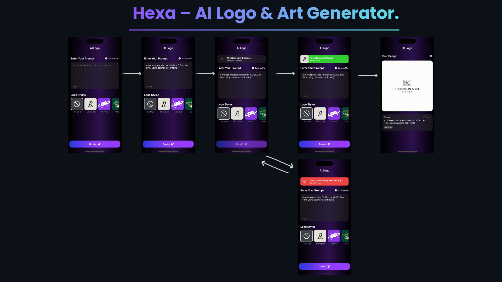

📌 Deployment Status

The project is fully implemented on the frontend and backend, but Firebase Functions could not be deployed due to a error.




# Hexa

**Hexa** is a modern, modular, and scalable React Native app for creative logo generation. It allows users to enter prompts, select logo styles, and instantly generate designs with visual feedback.

---


## 🎬 Demo


---

## 🛠 Usage

1. Enter a prompt in the input field.  
2. Select a logo style.  
3. Press **Create**.  
4. The StatusChip updates according to the API response.  
5. If successful, the app navigates to OutputScreen to display the logo.  
6. Retry on failure.

---
An AI-powered branding tool that generates logo concepts from user prompts.

## What it demonstrates
- AI-driven UI interaction
- Prompt-based input system
- Image generation workflow
- Frontend product thinking

## Role
Frontend + product UI development

## Key focus
- UX for AI tools
- Prompt handling
- Output visualization system

## 🏗 Architecture

- **Frontend**
  - Built with **React Native** and **Expo**
  - State management via `useState` and custom hooks
  - Components:
    - `InputScreen` → Prompt input, logo selection, Create button
    - `StatusChip` → Status display (InProgress / Completed / Failed)
    - `OutputScreen` → Display generated logo

- **Backend**
  - Built with **Python 3.11+** and **FastAPI**
  - Mock logo generation endpoint with optional simulated errors

---

## ⚙️ Requirements

### Frontend
- Node.js >= 18  
- npm or yarn  
- Expo CLI  
- React Native  
- @tanstack/react-query  
- react-native-toast-message  
- expo-linear-gradient  

### Backend
- Python 3.11+  
- pip  
- FastAPI  
- Uvicorn  
- Pydantic  

---

## 🚀 Setup & Running

### 1️⃣ Backend

```bash
cd src/backend

# Create virtual environment
python3 -m venv venv

# Activate virtual environment (macOS/Linux)
source venv/bin/activate

# Install dependencies
pip install -r requirements.txt

# Run FastAPI server
uvicorn main:app --reload
```

- FastAPI backend will run at: http://127.0.0.1:8000  
- Swagger UI: http://127.0.0.1:8000/docs  
- POST /create-logo accepts JSON:
```json
{ "prompt": "A futuristic logo for a tech startup" }
```

Note: The backend may randomly fail when the simulated processing time exceeds 5 seconds.

### 2️⃣ Frontend

```bash
# Install dependencies
npm install
# or
yarn install

# Start Expo
npm start
# or
yarn start
```

---

## 📝 Features

- Input a prompt to generate a logo  
- Select a logo style  
- StatusChip indicating:
  - InProgress — Logo generation in progress
  - Completed — Logo successfully created
  - Failed — Error occurred; allows retry  
- API calls handled via TanStack Query  
- Mock logo generation backend

---

## ⚡ API Behavior

- POST /create-logo → expects:
```json
{ "prompt": "string" }
```

- Example response:
```json
{
  "logo_url": "../../assets/logo.png",
  "prompt": "User input",
  "status": "created",
  "created_at": "2025-12-03T14:00:00.000000"
}
```

---

## ⚠️ Notes

- Ensure backend is running before using the app.

### ➕ Alternative backend — Local job processor (polling)

If you prefer not to deploy Cloud Functions, you can run a simple local job processor that polls Firestore for new jobs and processes them (uses the same logic as the Cloud Function).

1. Create a virtual env and install deps:

```bash
cd functions
python3 -m venv venv
source venv/bin/activate
pip install google-cloud-firestore
```

2. If you want to use the Firestore emulator (recommended for local testing):

- Start the Firestore emulator:
  - gcloud: `gcloud emulators firestore start --host-port=localhost:8080`
- Point the client to the emulator:
  - `export FIRESTORE_EMULATOR_HOST=localhost:8080`
  - `export GOOGLE_CLOUD_PROJECT=your-project-id`

3. Run the local processor:

```bash
python processor.py
```

The processor will poll the `jobs` collection for documents with `"status": "pending"`, simulate processing (random delay) and update each job with `"status": "done"` and an `output` URL.

Notes:
- For production against real Firestore, authenticate with a service account (set GOOGLE_APPLICATION_CREDENTIALS).
- The processor is intended for local/dev use or simple deployments (not a scalable production queue).


